# Case Study #1: Danny's Diner

[Case study brief →](https://8weeksqlchallenge.com/case-study-1/)

Danny's Diner wants to understand customer visiting patterns, spend, and favourite menu items, and to evaluate whether a loyalty program is worth building.

**Jump to:** [ERD](#erd) · [Setup](#setup-a-materialized-view-for-the-recurring-join) · [Q1](#1-what-is-the-total-amount-each-customer-spent-at-the-restaurant) · [Q2](#2-how-many-days-has-each-customer-visited-the-restaurant) · [Q3](#3-what-was-the-first-item-from-the-menu-purchased-by-each-customer) · [Q4](#4-what-is-the-most-purchased-item-on-the-menu-and-how-many-times-was-it-purchased-by-all-customers) · [Q5](#5-which-item-was-the-most-popular-for-each-customer) · [Q6](#6-which-item-was-purchased-first-by-the-customer-after-they-became-a-member) · [Q7](#7-which-item-was-purchased-just-before-the-customer-became-a-member) · [Q8](#8-what-is-the-total-items-and-amount-spent-for-each-member-before-they-became-a-member) · [Q9](#9-if-each-1-spent-equates-to-10-points-and-sushi-has-a-2x-points-multiplier-how-many-points-would-each-customer-have) · [Q10](#10-in-the-first-week-after-a-customer-joins-the-program-including-their-join-date-they-earn-2x-points-on-all-items-not-just-sushi-what-are-the-total-points-for-a-and-b-by-the-end-of-january) · [Bonus](#bonus-rank-all-the-things)

## ERD

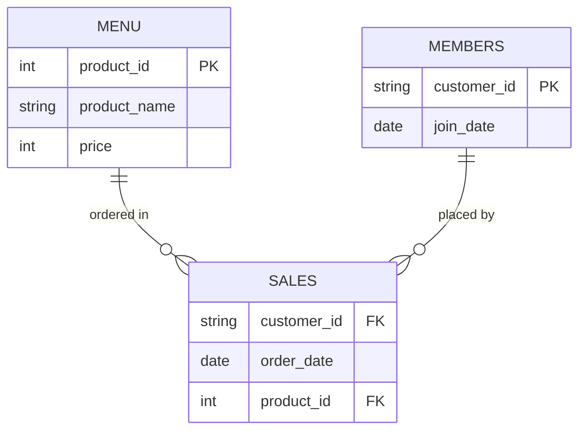

## Setup: a materialized view for the recurring join

Every question below needs `menu` (for `product_name`, `price`) and `members` (for `join_date`) joined to `sales`. One materialized view, `sales_menu_members`, does that join once. Every query after this just selects from it.

```sql
CREATE MATERIALIZED VIEW `dannys_diner.sales_menu_members` AS
SELECT
  s.customer_id,
  s.order_date,
  s.product_id,
  m.product_name,
  m.price,
  mem.join_date,
  CASE
    WHEN s.order_date >= mem.join_date AND mem.join_date IS NOT NULL THEN 'Y'
    ELSE 'N'
  END AS is_member
FROM `dannys_diner.sales` s
JOIN `dannys_diner.menu` m
  ON s.product_id = m.product_id
LEFT JOIN `dannys_diner.members` mem
  ON s.customer_id = mem.customer_id;
```

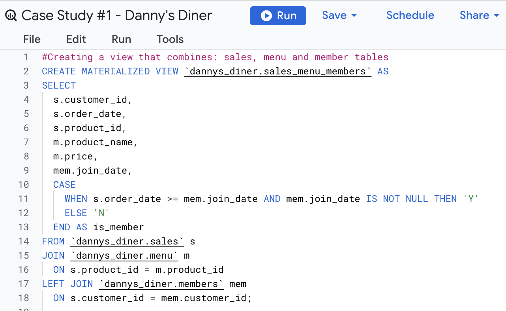

**Why a materialized view, not a plain view:** BigQuery materialized views can only reference base tables directly. No nested views, no window functions, no `ORDER BY`, restricted join patterns. This join fits inside those limits.

**Honest caveat:** this is a static 15-row dataset. It never changes, so the refresh never triggers. No real performance win over a plain view, just extra storage. Used it anyway to show the pattern correctly.

## Questions

### 1. What is the total amount each customer spent at the restaurant?

```sql
SELECT
  customer_id,
  SUM(price) AS total_amount
FROM `dannys_diner.sales_menu_members`
GROUP BY customer_id
ORDER BY customer_id;
```

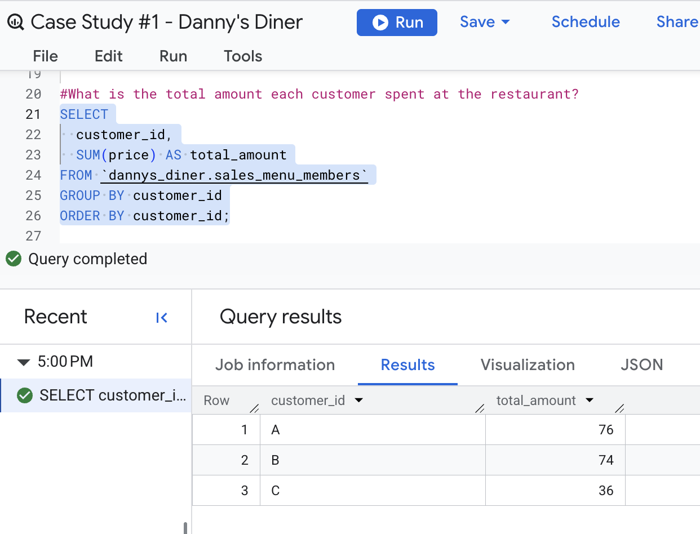

| customer_id | total_amount |
|---|---|
| A | 76 |
| B | 74 |
| C | 36 |

### 2. How many days has each customer visited the restaurant?

```sql
SELECT
  customer_id,
  COUNT(DISTINCT order_date) AS visit_count
FROM `dannys_diner.sales_menu_members`
GROUP BY customer_id
ORDER BY customer_id;
```

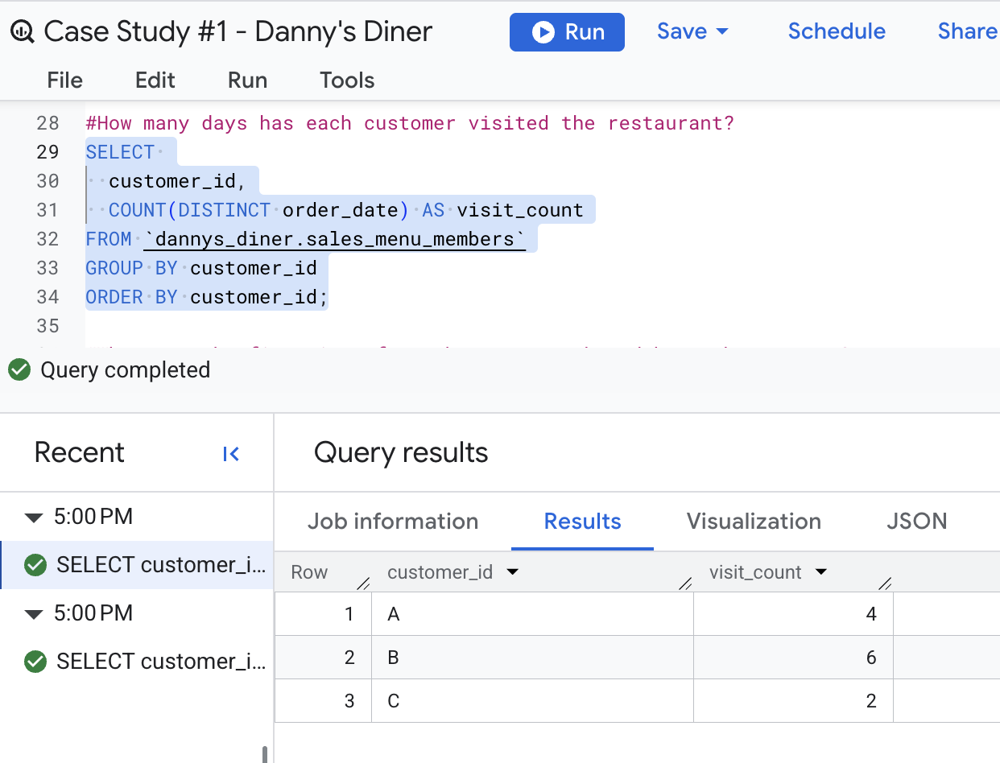

| customer_id | visit_count |
|---|---|
| A | 4 |
| B | 6 |
| C | 2 |

### 3. What was the first item from the menu purchased by each customer?

```sql
WITH cte AS (
  SELECT
    customer_id,
    product_name,
    order_date,
    ROW_NUMBER() OVER (PARTITION BY customer_id
      ORDER BY order_date, product_id) AS rn
  FROM `dannys_diner.sales_menu_members`
)

SELECT
  customer_id,
  product_name,
  order_date
FROM cte
WHERE rn = 1;
```

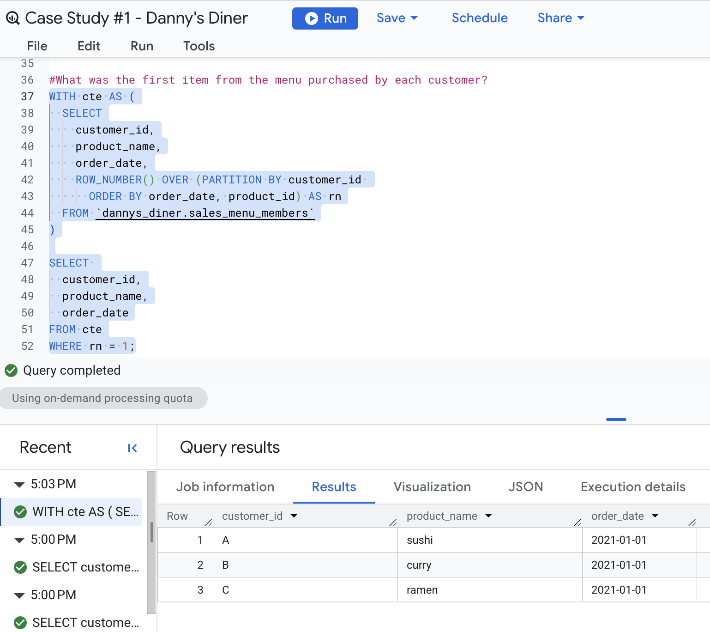

| customer_id | product_name | order_date |
|---|---|---|
| A | sushi | 2021-01-01 |
| B | curry | 2021-01-01 |
| C | ramen | 2021-01-01 |

**The tie:** A ordered sushi and curry both on 2021-01-01. C ordered ramen twice on the same day. No natural tiebreaker exists in the data.

**Two options considered:**
- `ROW_NUMBER()` + `ORDER BY order_date, product_id`: one deterministic answer, but the tiebreak (lowest `product_id` wins) is arbitrary, not a real signal of order.
- `DENSE_RANK()`: shows all tied rows, more honest, but returns multiple rows per customer.

**Went with:** `ROW_NUMBER()` + the tiebreak. One deterministic answer beats exposing the tie.

### 4. What is the most purchased item on the menu and how many times was it purchased by all customers?

```sql
WITH cte AS (
  SELECT
    product_name,
    COUNT(*) AS order_count,
    DENSE_RANK() OVER (ORDER BY COUNT(product_name) DESC) AS rn
  FROM `dannys_diner.sales_menu_members`
  GROUP BY product_name
)

SELECT
  product_name,
  order_count
FROM cte
WHERE rn = 1;
```

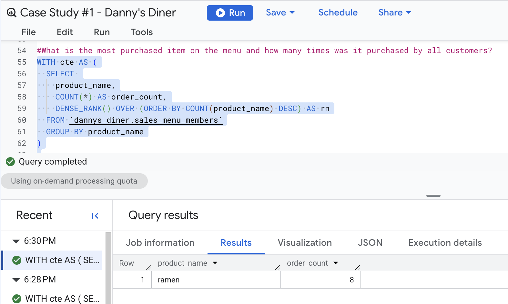

| product_name | order_count |
|---|---|
| ramen | 8 |

### 5. Which item was the most popular for each customer?

```sql
WITH cte AS (
  SELECT
    customer_id,
    product_name,
    COUNT(product_name) AS purchase_count,
    DENSE_RANK() OVER (PARTITION BY customer_id
      ORDER BY COUNT(product_name) DESC) AS rn
  FROM `dannys_diner.sales_menu_members`
  GROUP BY
    customer_id,
    product_name
)

SELECT
  customer_id,
  product_name,
  purchase_count
FROM cte
WHERE rn = 1;
```

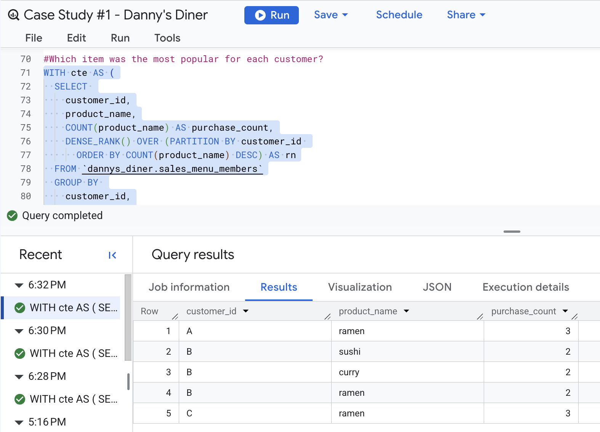

| customer_id | product_name | purchase_count |
|---|---|---|
| A | ramen | 3 |
| B | sushi | 2 |
| B | curry | 2 |
| B | ramen | 2 |
| C | ramen | 3 |

### 6. Which item was purchased first by the customer after they became a member?

```sql
WITH cte AS (
  SELECT
    customer_id,
    product_name,
    order_date,
    ROW_NUMBER() OVER (PARTITION BY customer_id ORDER BY order_date) AS rn
  FROM `dannys_diner.sales_menu_members`
  WHERE is_member = 'Y'
)

SELECT
  customer_id,
  product_name
FROM cte
WHERE rn = 1;
```

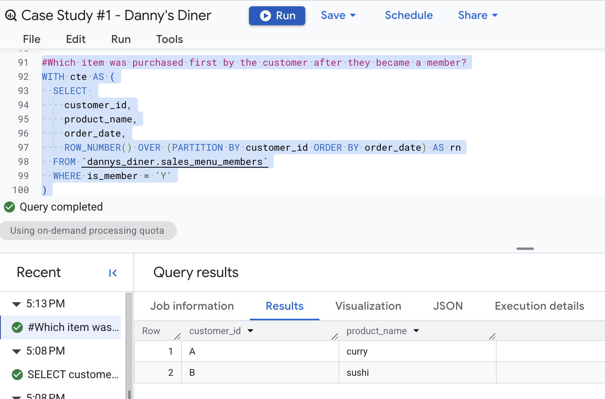

| customer_id | product_name |
|---|---|
| A | curry |
| B | sushi |

C never joined the loyalty program, so C has no rows here.

### 7. Which item was purchased just before the customer became a member?

```sql
WITH cte AS (
  SELECT
    customer_id,
    product_name,
    ROW_NUMBER() OVER (PARTITION BY customer_id ORDER BY order_date DESC) AS rn
  FROM `dannys_diner.sales_menu_members`
  WHERE order_date < join_date
)

SELECT
  customer_id,
  product_name
FROM cte
WHERE rn = 1;
```

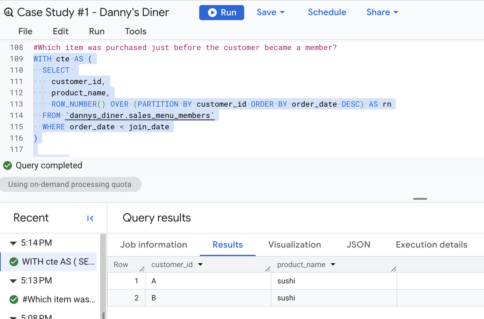

| customer_id | product_name |
|---|---|
| A | sushi |
| B | sushi |

### 8. What is the total items and amount spent for each member before they became a member?

```sql
SELECT
  customer_id,
  COUNT(*) AS order_count,
  SUM(price) AS total_amount
FROM `dannys_diner.sales_menu_members`
WHERE order_date < join_date
GROUP BY customer_id
ORDER BY customer_id;
```

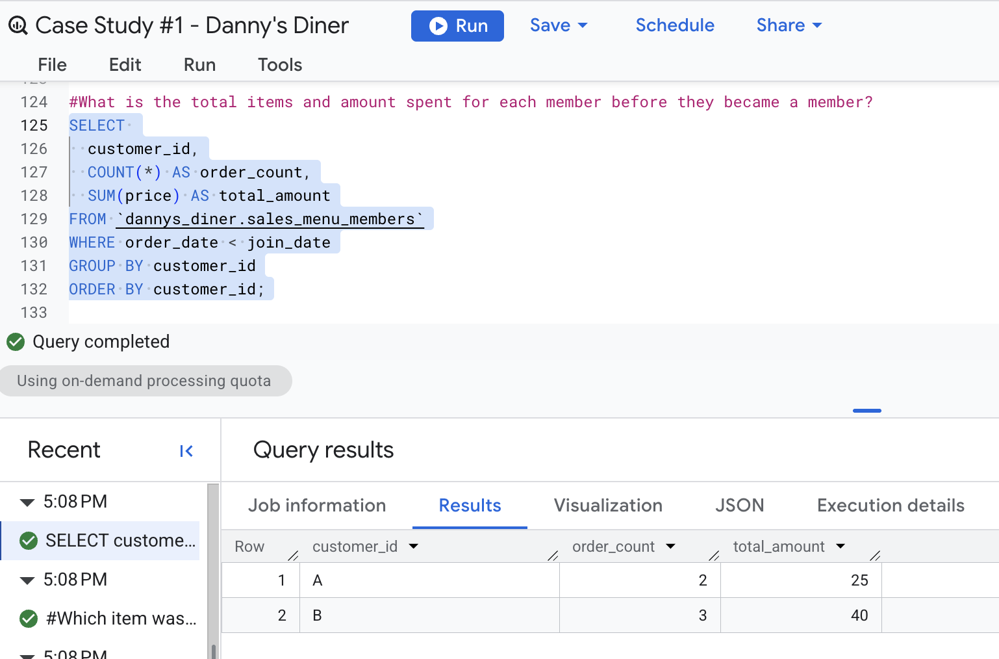

| customer_id | order_count | total_amount |
|---|---|---|
| A | 2 | 25 |
| B | 3 | 40 |

### 9. If each $1 spent equates to 10 points and sushi has a 2x points multiplier, how many points would each customer have?

```sql
SELECT
  customer_id,
  SUM(CASE
    WHEN product_name = 'sushi' THEN price*20
    ELSE price*10
  END) AS total_points
FROM `dannys_diner.sales_menu_members`
GROUP BY customer_id
ORDER BY customer_id;
```

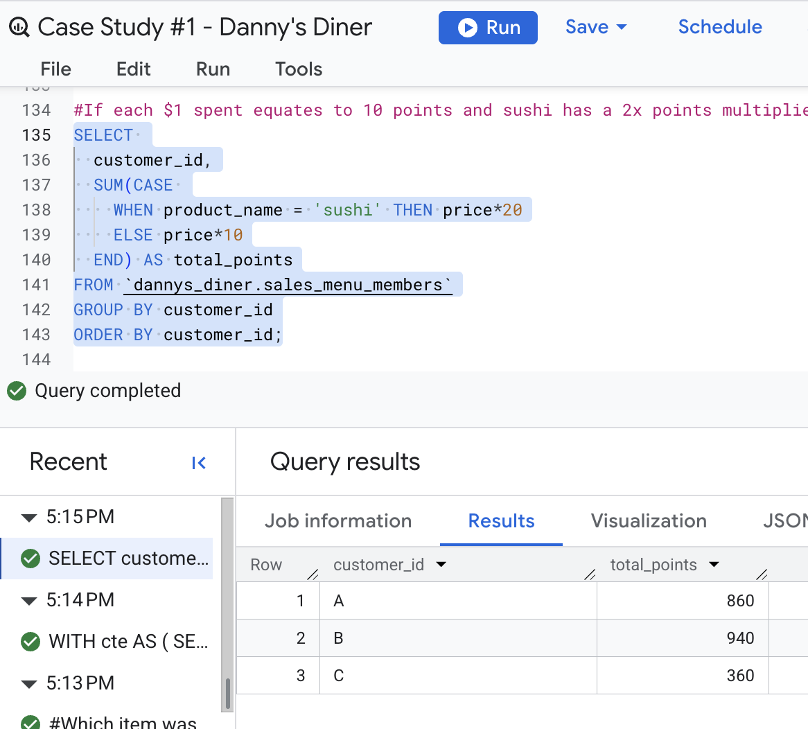

| customer_id | total_points |
|---|---|
| A | 860 |
| B | 940 |
| C | 360 |

### 10. In the first week after a customer joins the program (including their join date), they earn 2x points on all items, not just sushi. What are the total points for A and B by the end of January?

```sql
SELECT
  customer_id,
  SUM(CASE
    WHEN order_date BETWEEN join_date AND
      DATE_ADD(join_date, INTERVAL 6 DAY) THEN price*20
    WHEN product_name = 'sushi' THEN price*20
    ELSE price*10
  END) AS total_points
FROM `dannys_diner.sales_menu_members`
WHERE join_date IS NOT NULL
  AND order_date <= '2021-01-31'
GROUP BY customer_id
ORDER BY customer_id;
```

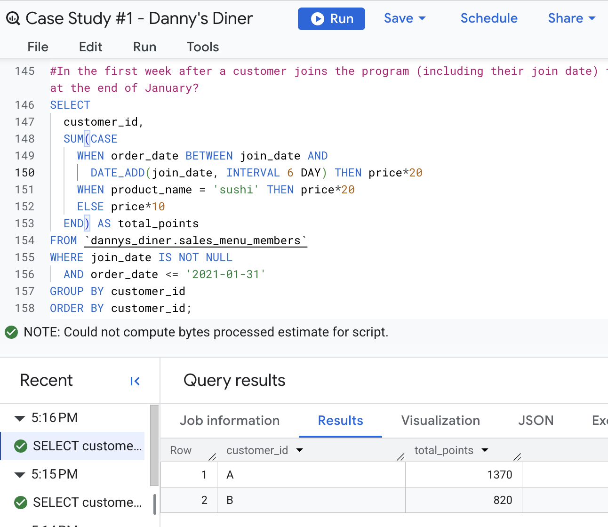

| customer_id | total_points |
|---|---|
| A | 1370 |
| B | 820 |

C is excluded. C never joined, and this question only applies to members.

## Bonus: Rank All The Things

Ranking of customer products, but no ranking for purchases made before someone became a member. Those get `NULL`.

```sql
SELECT
  *,
  CASE
    WHEN is_member = 'Y' THEN DENSE_RANK()
      OVER (PARTITION BY customer_id, is_member ORDER BY order_date)
    ELSE NULL
  END AS ranking
FROM `dannys_diner.sales_menu_members`;
```

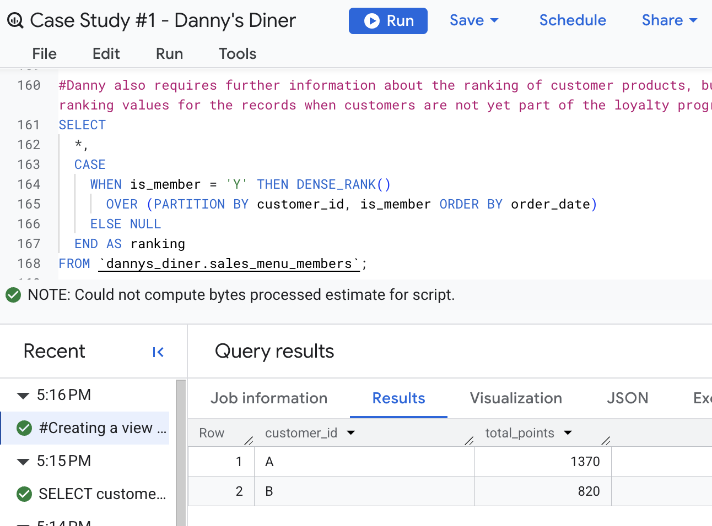

## Full script

Runnable end-to-end version of everything above: [`solution.sql`](./solution.sql)
